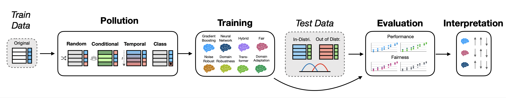
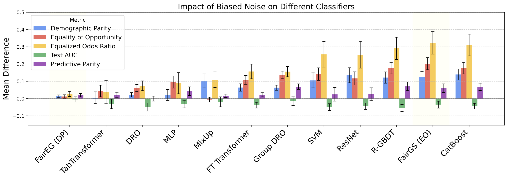

# Fault Lines: A Benchmark for ML Classifier Robustness to Label Noise with Fairness Considerations

This repository contains the implementation and benchmark for "Fault Lines: A Benchmark for ML Classifier Robustness to Label Noise with Fairness Considerations" - a comprehensive evaluation framework for testing machine learning model robustness to various types of label noise while considering fairness implications.

## Overview

Real-world datasets often contain label errors that can significantly impact machine learning model performance and fairness. This benchmark provides:

- **15 diverse tabular datasets** with systematic label noise injection
- **6 different noise types** including random, biased, correlated, and temporal noise
- **20+ state-of-the-art models** evaluation including gradient boosting, transformers, and fairness-aware models
- **Comprehensive fairness metrics** to assess equity across demographic groups
- **Data cleaning pipeline integration** to test noise mitigation strategies

## Key Findings

- Models maintain strong performance under high random noise (up to 40%) but are significantly less robust to biased noise (<10%)
- Transformer-based models show greater resilience to biased noise compared to boosting models
- Performance metrics alone can mask severe fairness degradation under label noise
- Dataset characteristics (size, imbalance, feature complexity) significantly influence noise sensitivity

## Repository Structure

fault_lines/
├── add/                          # Additional modules
│   ├── cleaning_algo.py         # Data cleaning algorithms
│   └── ReweightingGridSearch.py # Fairness reweighting methods
├── images/                      # Figures and visualizations
├── pollute/                     # Noise injection modules
│   ├── dataset_noise_conditions.py
│   ├── main_pollute.py
│   └── noise_classes.py
├── results/                     # Experimental results
├── tableshift/                  # TableShift integration
├── main.py                      # Main training script
├── eval.py                      # Evaluation utilities
└── requirements.txt             # Dependencies

## Prerequisites

### TableShift Dataset Access

This benchmark builds upon the TableShift framework (https://github.com/mlfoundations/tableshift). You'll need to:

1. Clone the original TableShift repository:
  git clone https://github.com/mlfoundations/tableshift.git

2. Follow their setup instructions to download the datasets. Refer to their documentation for dataset access requirements and download procedures.

3. Ensure the TableShift datasets are accessible to this codebase.

### Dependencies

Install the required packages:

pip install -r requirements.txt

Key dependencies include:
- pandas, numpy, scikit-learn
- catboost, lightgbm, xgboost
- fairlearn
- optuna (for hyperparameter optimization)
- torch (for neural network models)

## Quick Start

### Basic Model Training

Train a CatBoost model with random noise:

python main.py --experiment diabetes_readmission --model catboost --noise_type random --flip_prob 0.1

### Fairness-Aware Training

Train a fairness-aware model with biased noise:

python main.py --experiment diabetes_readmission --model faireg --constraint_type demographic_parity --noise_type biased --flip_prob 0.1

### Data Cleaning Integration

Apply data cleaning before training:

python main.py --experiment diabetes_readmission --model catboost --noise_type biased --flip_prob 0.1 --cleaning_method custom --cleaning_params '{"custom_param": 0.3}'

## Supported Models

### Standard ML Models
- **Gradient Boosting**: XGBoost, LightGBM, CatBoost, Robust-GBDT
- **Neural Networks**: MLP, ResNet, FT-Transformer, TabTransformer, SAINT
- **Linear Models**: SVM, Logistic Regression

### Fairness-Aware Models
- **FairEG**: Exponentiated Gradient (fairlearn)
- **FairGS**: Grid Search (fairlearn)
- **FairRS**: Random Search reweighting

### Robustness Models
- **DRO**: Distributionally Robust Optimization
- **Group DRO**: Group-specific robust optimization
- **IRM**: Invariant Risk Minimization
- **MixUp**: Data augmentation approach

## Noise Types

The benchmark supports six types of label noise:

1. **Random**: Uniform random label flipping
2. **Biased**: Group-dependent noise based on sensitive attributes
3. **Conditional**: Noise conditional on specific feature values
4. **Correlated**: Noise based on multiple feature interactions
5. **Concatenated**: Noise triggered by any of multiple conditions
6. **Temporal/Age-based**: Time or age-dependent noise patterns

## Command Line Arguments

### Core Arguments
- --experiment: Dataset name (e.g., 'diabetes_readmission', 'adult')
- --model: Model type ('catboost', 'faireg', 'fairgs', 'fairrs')
- --noise_type: Type of noise injection ('random', 'biased', 'correlated', 'concatenated', 'age_based')
- --flip_prob: Noise probability (0.0-1.0)

### Fairness Arguments
- --constraint_type: Fairness constraint ('demographic_parity', 'equalized_odds', 'error_rate_parity', 'equal_opportunity', 'predictive_equality')

### Cleaning Arguments
- --cleaning_method: Data cleaning approach ('none', 'custom')
- --cleaning_params: JSON string with cleaning parameters

### Training Arguments
- --num_samples: Number of hyperparameter optimization trials (default: 100)
- --random_seed: Random seed for reproducibility (default: 42)
- --use_gpu: Enable GPU acceleration for compatible models

## Available Datasets

The benchmark uses 15 datasets from TableShift spanning multiple domains:

### Healthcare
- Hospital Readmission
- ICU Mortality & Length of Stay
- Diabetes
- Hypertension
- Sepsis

### Finance
- FICO HELOC

### Social Outcomes
- ACS Income, Unemployment, Food Stamps, Public Coverage
- ANES Voting
- College Scorecard

### Other
- NHANES Lead
- Assistments (Education)

## Evaluation Metrics

### Performance Metrics
- **Accuracy**: Overall classification accuracy
- **AUC**: Area Under the ROC Curve

### Fairness Metrics
- **Demographic Parity**: Equal positive prediction rates across groups
- **Equalized Odds**: Equal TPR and FPR across groups
- **Equality of Opportunity**: Equal TPR across groups
- **Predictive Parity**: Equal precision across groups

## Results and Analysis

Results are automatically saved to CSV files in the results/ directory with comprehensive metrics including:

- Model performance on clean and noisy data
- Fairness metrics across different demographic groups
- Noise detection and cleaning statistics
- Hyperparameter optimization details

## Extending the Benchmark

### Adding New Cleaning Methods

1. Implement a new class in add/cleaning_algo.py inheriting from DataCleaningMethod
2. Add the method to the cleaning factory in main.py
3. Update command-line choices

### Adding New Noise Types

1. Implement noise logic in pollute/noise_classes.py
2. Update the DatasetNoiseInjector in pollute/main_pollute.py
3. Add to command-line choices

### Adding New Models

1. Add model configuration to the model factory in main.py
2. Implement any required preprocessing or fitting logic
3. Update command-line choices

## Citation

If you use this benchmark in your research, please cite:

@article{jackson2024fault,
 title={Fault Lines: A Benchmark for ML Classifier Robustness to Label Noise with Fairness Considerations},
 author={Jackson, David and Groth, Paul and Harmouch, Hazar},
 journal={PVLDB},
 volume={14},
 number={1},
 year={2024}
}

## Contributing

We welcome contributions! Please see our contribution guidelines and feel free to:

- Report bugs or issues
- Suggest new features or improvements
- Add new datasets, models, or noise types
- Improve documentation

## License

This project is licensed under the Creative Commons BY-NC-ND 4.0 International License.

## Acknowledgments

This work builds upon the excellent TableShift benchmark (https://github.com/mlfoundations/tableshift). We thank the TableShift authors for providing the foundational framework and datasets that made this research possible.
