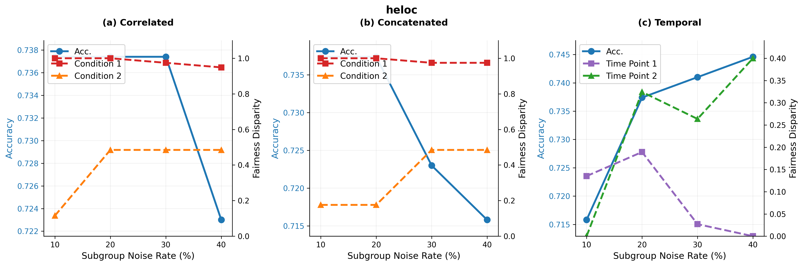
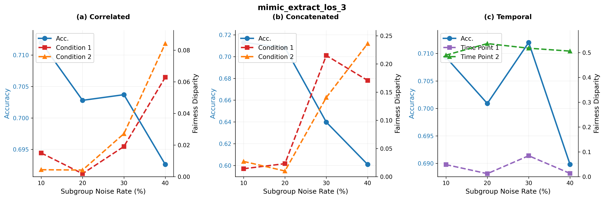

# Complex Label Noise Analysis Results

This directory contains more detailed results from experiments with three complex noise types (correlated, concatenated, and temporal) across 15 datasets from the Fault Lines benchmark. 

## Experimental Design

### Noise Types Tested

1. **Correlated Noise**: Labels are flipped when BOTH conditions are met simultaneously (C₁ ∩ C₂)
2. **Concatenated Noise**: Labels are flipped when EITHER condition is met (C₁ ∪ C₂)  
3. **Temporal Noise**: Label flip probability varies along a temporal dimension (age, year, etc.)

## Dataset Characteristics

The following table shows the conditions for each dataset as well as their coverage within the dataset.

### Combo Conditions Analysis
| Dataset | Condition 1 (C₁)          | Condition 2 (C₂)             | C₁ ∩ C₂ | C₁ ∪ C₂ | C₁     | C₂     |
|---------|---------------------------|------------------------------|---------|---------|--------|--------|
| ACS Food Stamps | Minority race             | English proficiency          | 15.31%  | 85.93%  | 28.2%  | 73.08% |
| ACS Income | Minority race             | Older age                    | 9.57%   | 68.98%  | 28.9%  | 49.65% |
| ACS Public Coverage | Minority race             | Employment Status of Parents | 1.04%   | 32.47%  | 28.6%  | 4.86%  |
| ACS Unemployment | Minority race             | Migration status             | 4.39%   | 35.50%  | 23.4%  | 16.49% |
| ANES | No answer to question 302 | No answer to question 301    | 1.56%   | 20.46%  | 20.46% | 1.56%  |
| Assistments | High attempt usage        | Hint usage                   | 10.99%  | 20.22%  | 19.4%  | 11.81% |
| BRFSS Blood Pressure | Poverty condition         | Older age                    | 11.65%  | 53.13%  | 24.9%  | 39.78% |
| BRFSS Diabetes | High BMI                  | Smoker                       | 9.96%   | 50.78%  | 30.9%  | 29.84% |
| College Scorecard | Veteran status            | Admission rate               | 6.49%   | 45.95%  | 25.5%  | 26.98% |
| Diabetes Readmission | Minority race             | Gender                       | 12.25%  | 61.31%  | 20.2%  | 53.32% |
| HELOC | Delinquency history       | Fewer trades                 | 21.26%  | 48.06%  | 21.3%  | 48.06% |
| MIMIC LOS | Older age                 | Gender                       | 11.15%  | 57.04%  | 29.4%  | 38.19% |
| MIMIC Mortality | Older age                 | Gender                       | 10.6%   | 56.89%  | 30.4%  | 37.49% |
| NHANES Lead | Younger Demographic       | Gender                       | 12.46%  | 63.19%  | 24.45% | 51.2%  |
| Physionet | Heart rate failure        | Temperature failure          | 10.03%  | 75.09%  | 19.0%  | 66.12% |

This table shows the temporal condition chosen for each dataset. 

### Temporal Dimensions
| Dataset | Temporal Column |
|---------|-----------------|
| ACS Food Stamps | Age |
| ACS Income | Age |
| ACS Public Coverage | Age |
| ACS Unemployment | Age |
| ANES | Year |
| Assistments | Response time |
| BRFSS Diabetes | Year |
| College Scorecard | Age at entry |
| Diabetes Readmission | Age |
| HELOC | Months since oldest trade |
| MIMIC LOS | Time since measurement |
| MIMIC Mortality | Time since measurement |
| NHANES Lead | Year |
| Physionet | Age |

## Results by Dataset

For time point 1 (less polluted), we selected more recent (younger) samples, and for time point 2 (more polluted), we selected older samples.

Note: While the figures show CatBoost results for clarity, we tested all models and observed consistent relative performance patterns across complex noise types, similar to the biased noise scenario. Please refer to the results directory for full results. 

### ACS Public Coverage

Condition 2's low coverage (4.86%) results in similar fairness for concatenated and correlated. Condition 1 is only really affected for concatenated noise, just like performance (due to broader noise impact). The temporal example clearly shows how 'older' participants are impacted stronger by the noise. 

### ACS Food Stamps  

With correlated noise, race-based disparities (condition 1) rise sharply due to overlap between the affected group (15.31%) and minority prevalence (28.2%). Concatenated noise, impacting a larger share of data (85.93%), worsens condition 2's fairness more visibly. Under temporal noise, time point 2's fairness values increase more sharply than time point 1's.

### ACS Income

Correlated overlap mainly affects minority race fairness with stable accuracy, concatenated noise steadily degrades older age fairness and accuracy across groups. Temporal noise moderately affects overall fairness and performance.

### ACS Unemployment

Low intersection (4.39%) with moderate union (35.50%) demonstrates how different demographic overlaps create varied noise sensitivity.

### BRFSS Blood Pressure

Healthcare dataset showing temporal patterns based on age, with substantial fairness deterioration under concatenated noise affecting 53% of population.

### BRFSS Diabetes

Another healthcare dataset with year-based temporal effects and moderate population coverage in both intersection and union scenarios.

### Physionet (Sepsis)

Moderate overlap (10.03%) with extreme imbalance. High union for correlated noise (75.09%) results in near-global noise, causing sharper performance drops. Age-based noise leads to fairness changes for affected groups, with AUC significantly impacted.

### ANES Voting

With condition 2 being contained in condition 1, correlated noise heavily affects fairness for condition 1, with little performance change. Concatenated noise has an equivalent effect on condition 2, but also affects condition 1 and performance.

### NHANES Lead

Extremely imbalanced dataset with high union coverage (73.95%). Correlated and Concatenated noise have little effect up to a subgroup noise rate of 30%, while temporal noise modelerately affects accuracy, without correlating with either year groups.

### HELOC Credit

High overlap (21.26%) between delinquency and fewer trades, causing large fairness gaps (delinquency group). A clearly differing trend between the younger and older groups for temporal noise. 

### MIMIC Length of Stay

Moderate overlap between older age and gender results in fairness degradation and stable accuracy in the correlated case. Moderate union in concatenated scenario (57.04%) causes fairness harm, especially for age, with accuracy dropping ~3%.

### Diabetes Readmission

With correlated noise, race-based disparities rise sharply due to overlap between the affected group (12.2%) and minority prevalence (20.1%). Concatenated noise, impacting a larger share of data (61.3%), worsens gender fairness. Under temporal noise, which grows with age, younger patients (30–40) show higher equalized odds disparity despite less noise, driven by false-positive miscalibration from label inflation in older groups.

### MIMIC Hospital Mortality

Moderate overlap (10.6%) between older age and gender. Fairness degradation in correlated scenario is present, with stable accuracy (~1% drop). Moderate union (56.89%) causes fairness harm, especially for age, with accuracy dropping ~3%. Temporal Noise: Time-based noise significantly impacts fairness for older groups, with performance also degrading faster.

### Assistments Educational

Correlated Noise: Moderate overlap (10.99%) between high attempt and hint usage. Fairness degradation is present but less extreme. Low union (20.22%) causes localized fairness harm, with stable accuracy (~3% drop). Temporal noise causes minimal fairness changes and performance impact possibly due to weak alignment with sensitive attributes.

### College Scorecard

Both conditions have similar coverage (~25%), similar effects in correlated and concatenated noise scenario.

## Key Findings and Trends

### 1. Correlated Noise
- **Performance**: Accuracy stable (~1% drop), AUC drops ~3%, showing ranking ability is more affected.
- **Fairness**: Metrics (EO, DPD, EOR, PPD) worsen, especially for small, predictive subgroups (e.g., race, delinquency). Small overlaps (~1%) cause localized bias; large overlaps (~20%) cause significant fairness spikes.
- **Mechanism**: CatBoost splits aggressively on predictive subgroups, amplifying bias when noise corrupts these groups.
- **Imbalance**: Amplifies harm in imbalanced datasets (e.g., Unemployment, NHANES Lead), where small overlaps destabilize fairness.
- **Takeaway**: Models appear robust on accuracy but suffer severe fairness failures for small, predictive subgroups.

### 2. Concatenated Noise
- **Performance**: Accuracy drops ~3–5%, AUC drops ~1–2%, due to broader coverage (C₁ ∪ C₂).
- **Fairness**: Disparities are more widespread, with large unions (>60%) causing visible accuracy and fairness harm. Smaller unions (<40%) lead to localized fairness issues.
- **Mechanism**: Noise affects more splits, especially for large subgroups (e.g., gender), causing diffuse fairness harm.
- **Imbalance**: Amplifies fairness degradation in imbalanced datasets when noise hits minority classes.
- **Takeaway**: Broader fairness pollutant, with more visible performance drops and diffuse fairness harm.

### 3. Temporal Noise
- **Performance**: Accuracy drops steadily, but AUC is more sensitive due to temporal misalignment.
- **Fairness**: Disparities vary by noise direction (older vs. newer samples), with age-sensitive groups most affected.
- **Mechanism**: Models assume data stationarity; temporal noise breaks this, causing unstable boundaries and AUC degradation.
- **Imbalance**: Worse fairness collapse in imbalanced datasets when noise targets minority classes.
- **Takeaway**: Fairness failures can appear hidden in specific timeline segments.

### 4. Implications for Practice
- **Monitor Multiple Metrics**: Accuracy alone is insufficient, especially for imbalanced datasets.
- **Intersection Effects**: Small subgroups can experience disproportionate fairness harm.
- **Temporal Awareness**: Time-based noise requires time-aware validation strategies.
- **Dataset-Specific Strategies**: Mitigation must account for class imbalance and demographic composition.

Each plot demonstrates how different noise patterns affect model performance and fairness across varying demographic conditions and dataset characteristics.

## Fair Models under Concatenated Noise

The plot below shows the equalized odds results of three fairness-aware models on the ACS Unemployment dataset under two different constraint configurations. The dotted lines represent models where the fairness constraint targets C₂ (migration status), while the solid lines show models constrained on C₁ (race). This comparison demonstrates that fairness-aware models are only effective when they target the specific groups experiencing label noise corruption. When label quality deteriorates for multiple intersecting conditions (race and migration status under concatenated noise) but the model only constrains for one condition, systematic bias persists for the unconstrained demographic group. As shown in the paper, FairEG remains the most effective model.

